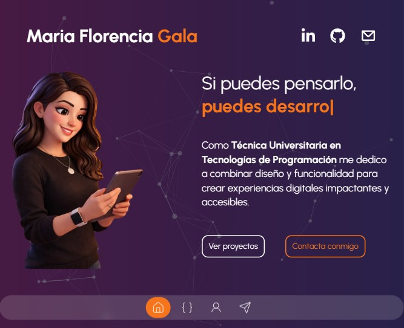

# María Florencia Gala

## Mi portfolio

Este es mi portfolio personal como desarrolladora, donde muestro mis proyectos, habilidades y experiencia a medida que las voy poniendo en práctica.

## Podés acceder a la página acá:
https://mariaflorenciagala.netlify.app/

## Preview



## Tecnologías que he usado en este proyecto

* Next.js
* React
* Tailwind CSS
* TypeScript
* Framer Motion
* Swiper

## Características

* Diseño moderno y responsive
* Animaciones suaves
* Sección de proyectos dinámica
* Navegación intuitiva
* Base de datos centralizada y fácil de escalar

## Instalación

```bash
git clone https://github.com/MariaFlorenciaGala/portfolioNext.git
cd portfolioNext
npm install
npm run dev
```

## Estructura del proyecto

```
/app 
/components
/public
/utils
```

## Contacto

* Email: [mariaflorenciagala8@gmail.com](mailto:mariaflorenciagala8@gmail.com)
* LinkedIn: https://www.linkedin.com/in/mariflor/
